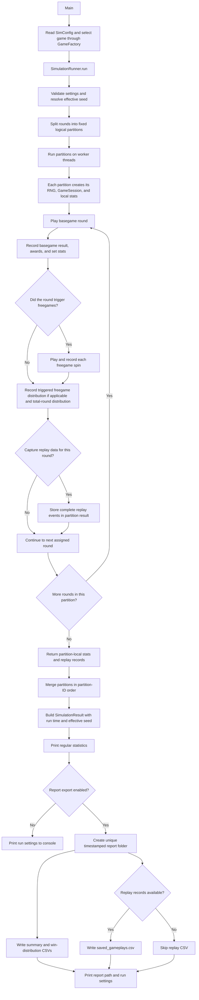

# Architecture

## Overview

The project is a small Java Monte Carlo game simulation. `Main` reads the selected game ID from `SimConfig`, asks `GameFactory` to create that game with its own config, and passes it to `SimulationRunner`. It then passes the merged statistics to the reporting class.

The source is grouped into separate game and simulation layers. `Main.java` stays in the default package at the repository root as the launch point; it wires game configuration and an implementation into the simulation layer. The simulation engine depends on the game contract, while game rules stay inside game implementations.

## Source layout

- `game/`: game contracts (`Game`, `GameSession`), selection factory, shared game result types, and implementations.
- `game/model/`: spin and base-round results passed from game sessions to the simulation layer, including shared round win-cap application and cap-hit metadata.
- `game/proxy/`: current probability-based example game and its `BasicProxyConfig`. Each future game should keep its own configuration with its implementation.
- `game/expandingwild/`: first reel-based game, with separate basegame, freegame, config, config adapter, and detailed spin results. Its game-wide config is separated from basegame and freegame spin sets; each set contains integer-ID regular-symbol strips, insertion rules, and multiplier settings. The adapter translates each set to GMF `Symbol` values.
- `GameModuleFramework/`: reusable symbols, reel strips and grids, weighted symbol insertion, payline evaluation and win selection, paytable award metadata, scatter counting and trigger evaluation, wild expansion, additive multiplier helpers, and generic weighted-table draws.
- `simulation/`: generic Monte Carlo execution and output.
- `simulation/config/`: simulation-wide settings.
- `simulation/engine/`: orchestration, worker threads, seeded partitions, and aggregation.
- `simulation/result/`: completed simulation output returned by the engine.
- `simulation/stats/`: incremental statistics and win-distribution calculations.
- `simulation/reporting/`: console formatting and report file creation.
- `toolkit/viewer/`: command-line win finder and screen printer for interactive game inspection.
- `toolkit/reelset/`: exact Cartesian reel-stop enumerator and full-cycle aggregate results.
- `toolkit/replay/`: saved-gameplay lookup, replay calculation, and validation.
- `toolkit/progress/`: shared progress display for long-running simulation and reelset jobs.
- `toolkit/player/`: balancing player presentation model, resizable reel viewport, and per-game adapters.
- `ToolkitGUI.java`: root-level Swing launcher with tabs for simulation, win viewing, full reelset evaluation, and replay.
- `Main.java`: root-level application entry point.

## Configuration

### `game.proxy.BasicProxyConfig`

Holds settings used only by the probability-based proxy:

- Win amounts and their cumulative probability thresholds.
- The paytable buckets used by `StandardStats`.
- The number of free spins awarded by a freegame trigger.

### `simulation.config.SimConfig`

Holds simulation-wide values:

- `gameId`: selects which game `Main` asks `game.GameFactory` to construct. It defaults to `expanding-wild`; set it to `basic-proxy` to run the probability proxy. Each factory entry creates that game's own configuration and implementation.
- `rounds`: number of basegame rounds to simulate.
- `stake`: stake per basegame round.
- `seed`: stored seed used when `usePreviousSeed` is enabled; `simulation.engine.SimulationRunner` replaces it with a randomly generated seed otherwise.
- `usePreviousSeed`: selects between replaying the configured seed and generating a new seed for this run.
- `exportReport`: selects console-only detailed output or file-based detailed reporting.
- `showAwards`: controls whether basegame and freegame award counts appear in the regular console and text report.
- `maxSavedGameplays`: maximum replayable rounds retained for CSV export; zero disables capture.
- `threads`: maximum worker threads used to process partitions.
- `partitions`: fixed logical work partitions used for deterministic seeding and result merging.

## Simulation flow

A browser page with visual renderings of the documented Mermaid diagrams is available at [flowcharts.html](flowcharts.html). It includes simulation, game creation, math validation, replay debugging, and the architecture overview. The page loads Mermaid from a CDN, so browser access requires an internet connection.

The standalone diagram, including both CLI and GUI entry points and the reporting export branches, is in [simulation-flow.md](simulation-flow.md).

For the recommended steps to add a future game module, see [game-creation-flow.md](game-creation-flow.md).

Use the fillable [game creation form](game-creation-form.md) to capture a new game's rules, configuration, implementation plan, tests, and validation evidence end to end.

For the Expanding Wild rules, configuration, features, results, replay, and known math limitations, see [ExpandingWildGame.md](../game/expandingwild/ExpandingWildGame.md). It is the detailed game-specific reference and complements this framework overview.

For validating game balance inputs and interpreting simulator output, see [game-math-validation-flow.md](game-math-validation-flow.md). For reconstructing and diagnosing saved rounds, see [replay-debugging-flow.md](replay-debugging-flow.md).



`simulation.engine.SimulationRunner` resolves the run's effective seed from `SimConfig.usePreviousSeed`. It divides the configured rounds into a fixed number of logical partitions and derives one seed from the run seed and each partition ID. Each task owns its `Random`, `GameSession`, statistics collectors, and at most the configured replay records for its round range. The game implementation creates sessions from the supplied random stream, keeping random sequences deterministic per partition. Tasks do not update shared statistics.

After all tasks finish, the runner merges each partition's statistics in partition-ID order. Fixed partitions and ordered merging keep results reproducible when the same seed, settings, and partition count are used, even if the worker-thread count changes. The effective seed and logical partition count are printed at the end of the console output and `simulation_stats.txt`.

`Main` creates `SimConfig`, asks `GameFactory` for the selected game, invokes the runner, and passes the merged results to `Print`. The factory creates the selected implementation together with its game-specific config. Each partition runs its assigned basegame rounds through `GameSession.playRound(totalRoundStake, maximumRoundWin)`. A game's `getMaxWinMultiplier()` supplies its round cap in stake units; the default is unlimited. The shared result layer clips outcomes that exceed the cap and drops later feature spins. Games can override the capped session method to stop generating feature outcomes as soon as the cap is reached. `GameRoundResult` records whether the cap was reached. The engine then:

1. Records the base spin in basegame statistics.
2. If the base result triggers free spins, records the trigger and each returned free spin in freegame totals, paytable buckets, and any named award categories returned with the spin.
3. Records one freegame distribution result equal to the sum of the free spins returned for that trigger.
4. Records one total-game distribution result equal to the basegame win plus any freegame wins for the round, and increments TotalGame Wincaps when the round reaches the configured cap.

This means the three win distributions have different observation units: basegame entries are base rounds, freegame entries are triggered freegames, and total-game entries are base rounds. A round without a freegame has no freegame distribution entry. Freegame RTP uses one basegame stake exposure per base round, not one stake per free spin.

### `simulation.engine.SimulationRunner` and `simulation.result.SimulationResult`

`SimulationRunner` validates the worker settings, resolves the seed, submits fixed partitions to an executor, and merges partition-local statistics in partition order. For games that expose set counts, it also aggregates a separate stats collector for each basegame and freegame set. It retains up to `maxSavedGameplays` rounds that return a complete ordered replay event list. `SimulationResult` carries these collectors and replay records back to `Main` for reporting.

### Replay records

`game.model.ReplayEvent` is a game-neutral envelope containing an event type, recorded win, and opaque game-owned payload. `GameRoundResult` returns the ordered replay events for the round, and `GameSession.replayRound` is the injection point used to recalculate them. A game may define any event types and payload schema; the simulation and CSV writer do not interpret that payload. `SavedGameplayCsv` writes one row per event with a repeated gameplay ID and round summary, allowing rounds with any number of feature events. A game that does not supply replay events is omitted from saved-gameplay output.

Expanding Wild stores the selected set, reel stops, inserted symbol locations, and resolved banner multiplier choices in a versioned JSON payload. Replaying injects these recorded choices directly, then recalculates the line wins using the active paytable and win cap. Insertion heat-map and multiplier weights are not redrawn; the recorded total, basegame, feature, and per-event wins are checked against recalculated outcomes by `toolkit.replay.ReplayerMain`. Reports containing replayable rounds add `saved_gameplays.csv`; distribution CSV formats remain unchanged.

Run the replayer from the project root with `java toolkit.replay.ReplayerMain reports/<report-folder>/saved_gameplays.csv <gameplay-id>`.

### `game.GameFactory`

Maps the `SimConfig.gameId` selection to a game implementation and constructs it with its game-specific configuration. `Main` passes the resulting `Game` to the runner and does not import a game's config class. Register future game implementations here with their own configuration classes.

## Game and result classes

### `game.Game` and `game.GameSession`

`Game` provides the paytable bucket shape, optional named award labels, a maximum win multiplier (unlimited by default), and creates sessions for a supplied random stream. Each `SpinResult` can carry zero or more award labels; statistics aggregate every occurrence, including multiple same-category line awards in one spin. Sessions receive the total round stake and absolute cap so game-specific paytables can scale line awards and stop features at the cap. `GameRoundResult` reports whether the cap was reached. The engine knows the shared round/result contract but does not construct specific game classes.

### `game.proxy.BasicProxyGame`

Implements `Game` using the simple probability-based proxy rules. Its session owns the proxy's basegame and freegame logic and returns their outcomes through the game contract.

### `game.proxy.GameBasic`, `GameBasicBase`, and `GameBasicFree`

These classes implement the proxy's individual spin logic. They are an example game implementation, not dependencies of the simulation engine.

### `game.expandingwild.ExpandingWildGame`

Implements the existing game contract with a 5x5 reel game. It keeps basegame and freegame logic separate, uses GMF for weighted symbol insertion and reel/grid and payline math, expands visible banners into full-height wild reels, and draws each freegame banner multiplier from its freegame set's weighted table before adding participating multipliers on paylines. Its configuration caps each basegame round at the configured stake multiple; the session clips the spin that reaches the cap and stops further free spins. The full reelset tool deliberately evaluates only regular reel symbols and paytable wins, skipping all feature mechanics. See [ExpandingWildGame.md](../game/expandingwild/ExpandingWildGame.md) for insertion defaults, paytable, paylines, tests, and known limits.

`ExpandingWildConfig` holds shared symbols, paytable, paylines, screen dimensions, scatter-trigger rules, freegame award count, and win cap. Its `baseGame` and `freeGame` mode configs each contain two independent `SpinSetConfig` values plus a weighted set selector (default 3:1 for set 0 to set 1). Every strip contains only regular symbols. Each set also has its own insertion rules: basegame set 0 inserts scatters on reels 1, 3, and 5; basegame and freegame set 1 insert banners; freegame set 0 inserts no specials. Insertion rules define count weights, a reel/row heat map, a per-reel maximum, and symbols that cannot be replaced.

### `GameModuleFramework`

Provides small reusable components used by the reel game: `Symbol`, `ReelStrip`, `ReelGrid`, `WildExpansion`, `Payline`, `Paytable`, `PaytableAward`, `PaylineEvaluator`, and `PaylineWinCalculator`. The generic calculator stake-scales line candidates, accepts a candidate-specific multiplier function, and resolves candidate wins using a `LineWinSelectionPolicy` (Expanding Wild selects the highest final payout). GMF also provides `ScatterCounter`, `ScatterTrigger`, `AdditiveMultipliers`, and `probability.WeightedTable`. The game config owns its symbols, symbol-ID mapping, integer reel strips, paylines, paytable, and feature settings; a game adapter converts integer strips into GMF reels. Multiplier assignment and result adaptation remain in the game module.

### `toolkit.viewer`

`ViewerMain` accepts a registered game ID and optional spin limit and stake. `WinFinder` creates a random game session and searches basegame and triggered freegame results until it finds the first positive-win screen or reaches the limit. `WinScreenPrinter` renders Expanding Wild's expanded grid and line details; games that provide only shared `SpinResult` data display their win and named awards. Run it from the project root with `java toolkit.viewer.ViewerMain expanding-wild`.

`FullReelsetMain` runs every unique stop-index combination for a game implementing `ExhaustiveReelGame`. `FullReelsetSimulator` partitions the Cartesian index range across selectable basegame sets, applies selector weights to award hits, RTP, and feature triggers, and does not execute triggered features. Weighted evaluation requires selectable sets to have the same total number of stop combinations. `ReelsetReportPrinter` presents award hits as a matrix with symbols in rows and match lengths in columns. `ReelStrip.windowAt` and `ReelGrid.atStops` provide the deterministic GMF stop-to-screen path. Both exhaustive and Monte Carlo runners use `toolkit.progress.ProgressBar` for large workloads; progress is written to standard error and small runs stay quiet. Run the exhaustive tool with `java toolkit.reelset.FullReelsetMain expanding-wild 1.0 8`.

### `game.model.SpinResult` and `game.model.GameRoundResult`

Immutable results for an individual spin and a complete basegame round. A round result contains one basegame spin and the list of freegame spins it triggered.

### `ToolkitGUI`

Launch the desktop toolkit from the project root with `java ToolkitGUI` after compiling the project. Its Simulation tab exposes game ID, rounds, stake, seed reuse, report export, award display, worker threads, logical partitions, and saved-gameplay count. The Win viewer takes game ID, maximum spins, and stake; Full reelset takes game ID, stake, and workers; Replay takes a saved-gameplay CSV and gameplay ID. A found Expanding Wild round can be opened in the prototype player; other games do not yet have player adapters. The GUI runs each operation on a background worker and streams its output into the window. Simulation reporting accepts a supplied writer so console output and report files stay consistent.

The Prototype player tab opens a separate resizable play window. It can also be launched directly with `java toolkit.player.PlayerMain`. `PlayerGameAdapter` maps a normal game-session round into `PlayerDisplayData` (stopped and transformed grids, awards, highlight positions, feature spins, and display metadata); the player renders that data without using simulation statistics or report generation. The first adapter is Expanding Wild. Positional wins support line, ways, or cluster highlighting, and the viewport sizes itself from the grid dimensions. The player maintains a local balance, supports manual or counted autoplay, and animates reels before revealing post-stop wild expansion and wins. Autoplay stop takes effect after the current complete round, including its triggered freegames. The viewer can preload its found Expanding Wild round as a no-cost preview; Replay Last Play charges the original stake and repeats that saved display outcome, including its feature spins.

## Statistics

### `simulation.stats.StandardStats`

Accumulates spin counts, total winnings, generic paytable buckets, named award counts, freegame trigger counts, stake exposure, and a win distribution. It receives the stake, paytable shape, and award labels when constructed rather than creating game configuration objects itself.

`addResult` records one individual spin in regular totals, paytable buckets, and named award counts. `recordWinInDistribution` separately records the value that represents one observation in a distribution. This separation lets freegame totals count each free spin while its distribution counts one sum per triggered freegame. Freegame RTP divides its winnings by basegame stake exposure recorded by the runner.

The win distributions map each win amount to a `long` frequency. Standard deviation is computed from the distribution. Aggregated win-band rows are also calculated from the distribution using the configured ranges: zero, then `(0, 1]`, `(1, 2]`, `(2, 3]`, `(3, 5]`, and successive bands through `(25,000, 10,000,000]`.

Each aggregate band reports:

- **Hits:** observations in that band.
- **% Of Winnings:** that band's total win divided by the distribution's total win.
- **% Of Hits:** band hits divided by observations in that distribution.
- **Frequency:** observations divided by band hits; zero when the band has no hits.
- **RTP:** band total win divided by total simulation stake.
- **Total Win:** sum of all wins in the band.

The percentage of hits and frequency use each distribution's own observation count. RTP uses total basegame stake for all three distributions so the rows show each category's contribution to overall simulation RTP.

## Reporting

### `simulation.reporting.Print`

Formats the regular summary and detailed distributions. It prints named award counts when a game supplies award labels, falling back to generic paytable buckets for games such as the probability proxy. The `showAwards` setting controls whether these award lines appear in console and text output. Set-aware games also print per-set rounds, winnings, RTP, and hits between the mode-wide sections and report metadata. Freegame set RTP uses total basegame stake exposure, matching the overall freegame RTP basis. These summaries do not change the win distributions or aggregated distribution tables. Total-game standard deviation is calculated from the total-game distribution. Reported win amounts are rounded to one decimal place in stake units to suppress floating-point display tails while preserving enough decimal places for the configured stake; distribution rows that round to the same displayed value are combined, including their hit counts. This changes presentation only; stored simulation values remain unchanged. It receives the same `SimConfig` instance used by `Main`, so the report uses the simulation's rounds, stake, output mode, and timing from `SimulationResult`.

When `exportReport` is `false`, the console receives only the regular summary statistics and run settings, including the selected game ID. No report files are created.

When `exportReport` is `true`, the console receives the regular summary statistics, a path to the generated report folder, and the run settings at the bottom, including the selected game ID. Detailed files are written under `reports/` in a timestamped `simulation-YYYY-MM-DD_HH-mm-ss` folder. A numeric suffix is added if another report already uses that timestamp. Each folder contains:

- `simulation_stats.txt`: the regular summary printed to the console, followed by selected game ID, logical partition count, effective seed, and total simulation time.
- `win_distributions.csv`: raw win amounts and hit counts.
- `win_distribution_aggregated.csv`: aggregated win-band values.
- `saved_gameplays.csv`: versioned event rows for replayable rounds, when the selected game supplies replay events.

Both CSVs group their sections in this order, with a blank row between sections: **Total Game, Basegame, Freegame**. The generated `reports/` directory and compiled `.class` files are ignored by Git.

## Tests

`tests/SimulationTests.java` covers generic statistics, deterministic merging, game selection, and reports. `game/expandingwild/tests/ExpandingWildGameTests.java` covers GMF mechanics, game rules, and a seeded simulator run. `ViewerTests`, `ReelsetTests`, and `ReplayTests` cover the toolkit flows; `PlayerTests` checks the player adapter, found-round adaptation, variable-size display model, and separation of stopped reels from expanded wilds. Run the suites with:

```sh
javac *.java tests/*.java game/expandingwild/tests/*.java
java -cp .:tests SimulationTests
java game.expandingwild.tests.ExpandingWildGameTests
java -cp .:tests PlayerTests
java -cp .:tests ViewerTests
java -cp .:tests ReelsetTests
java -cp .:tests ReplayTests
```

From the repository root, the normal launch flow is:

```sh
javac *.java
java Main
```

Launch the GUI instead with `java ToolkitGUI`.

`javac *.java` compiles `Main.java` and discovers the source dependencies in both layers. To compile every source explicitly, including tests, use `javac $(find . -name '*.java')`.

## Current scope

The code is an example simulation framework rather than a general-purpose engine. `simulation.engine.SimulationRunner` handles orchestration and parallel execution through the `game.Game` / `game.GameSession` contract. Both `game.proxy` and `game.expandingwild` implement that contract. The initial `GameModuleFramework` package contains reusable reel and line-win math; new generic mechanics should be added only when another game can use them. See [nextsteps.md](../nextsteps.md) for the proposed order of improvements.

Current boundaries to keep in mind: `GameRoundResult` and simulation accounting model one basegame result plus freegame spins, replay injection and the prototype player currently support Expanding Wild, and exhaustive reelset evaluation covers basegame outcomes only. Game configurations are Java data structures rather than externally loaded balance files. The GUI also has no cancellation control yet.
