# Future game creation flow

```mermaid
flowchart TD
    Idea[Define game rules and math inputs]
    Modes[Identify basegame and randomly triggered freegame modes]
    Config[Create game-specific config for symbols, reels, paytable, features and mode settings]
    Validate[Validate config invariants when constructing the game]
    Math[Implement reusable game math and mode spin logic]
    Session[Implement GameSession: play one complete round]
    Base[Play one basegame spin and produce typed SpinResult]
    Trigger{Did basegame randomly trigger freegames?}
    Free[Play configured freegame spins using the same round stake and RNG stream]
    Round[Return GameRoundResult with base result, free results and cap metadata]
    Game[Implement Game: createSession and provide stats metadata]
    Factory[Register game ID and config in GameFactory]
    TestRules[Test deterministic rules with controlled random outcomes]
    TestRun[Test seeded simulation, trigger frequency, stats and thread reproducibility]
    Replay{Will this game support saved replay?}
    ReplayImpl[Define versioned ReplayEvent payload and replayRound recalculation]
    Docs[Document rules, config, assumptions and known limits]
    Integrate[Verify selection from CLI and GUI; run and inspect report]
    Done[Game is ready for future simulations]

    Idea --> Modes --> Config --> Validate --> Math --> Session --> Base --> Trigger
    Trigger -->|Yes| Free --> Round
    Trigger -->|No| Round
    Round --> Game --> Factory --> TestRules --> TestRun --> Replay
    Replay -->|Yes| ReplayImpl --> Docs
    Replay -->|No| Docs
    Docs --> Integrate --> Done
```

Use this workflow when adding a game module. Keep game math and round orchestration inside `game/<game-name>/`; keep generic simulation, statistics, and reporting in `simulation/`.

## Implementation checklist

1. **Write down the rules first.** Specify symbols, reel/window sizes, paylines or other win evaluation, paytable units, feature trigger and award, retrigger behavior, stake basis, and maximum-win handling. Record assumptions that still need game-math approval.
2. **Keep configuration game-specific.** Add a config under the game package. Separate shared settings from basegame and freegame mode settings; represent multiple reel sets and weighted selection explicitly when needed. Validate dimensions, weights, indexes, and feature values before simulation starts.
3. **Build the math in small pieces.** Keep basegame spin evaluation and freegame spin evaluation focused. Reuse `GameModuleFramework` for common mechanics where it fits; keep game-specific rules in the game module.
4. **Implement the round contract.** The `GameSession` owns the random stream provided by `Game.createSession(random)`. `playRound` plays one basegame spin, checks its random freegame trigger, plays the awarded feature spins, applies the round win cap, and returns `GameRoundResult`. Pass the total basegame round stake consistently to the base spin and its free spins.
5. **Return useful typed results.** Populate `SpinResult` (or a game-specific subtype) with win amount, feature-trigger information, selected set index, and named awards as appropriate. Keep engine-level accounting generic; do not put simulation statistics in game logic.
6. **Expose metadata and register the game.** Implement `Game` metadata such as paytable buckets, award labels, basegame/freegame set counts, and max-win multiplier. Add a stable game ID and constructor branch to `GameFactory`; then confirm the existing CLI and GUI can select it.
7. **Test rules and integration.** Use controlled random streams for edge cases and trigger paths. Cover wins, losses, feature awards and counts, caps, invalid config, and any set-selection behavior. Add a seeded simulation test that checks accounting and repeatability across worker counts with a fixed partition count.
8. **Add replay when the game needs it.** Store the decisions needed to recalculate each spin in versioned `ReplayEvent` payloads, implement `replayRound`, and test that replay reproduces basegame, freegame, and total wins. Keep replay optional if the game does not need saved gameplay support.
9. **Document and verify.** Add a game-specific rules/config note, update `docs/architecture.md` and `nextsteps.md`, compile, run relevant tests, and run a small seeded simulation with and without report export.

## Existing reference points

- [ExpandingWildGame.md](../game/expandingwild/ExpandingWildGame.md) documents the current reel-based example game and its implementation-specific behavior.
- `game/Game.java`, `game/GameSession.java`, and `game/model/` define the simulation boundary and common results.
- `game/expandingwild/` is the reel-based reference for separate basegame/freegame modes, typed results, validation, and replay.
- `game/proxy/` is a smaller reference for a probability-based game.
- `game/GameFactory.java` is where a new game ID is registered.
- `simulation/engine/SimulationRunner.java` owns generic round iteration, statistics, partitioning, and replay collection. New game-specific rules should not be added there.
