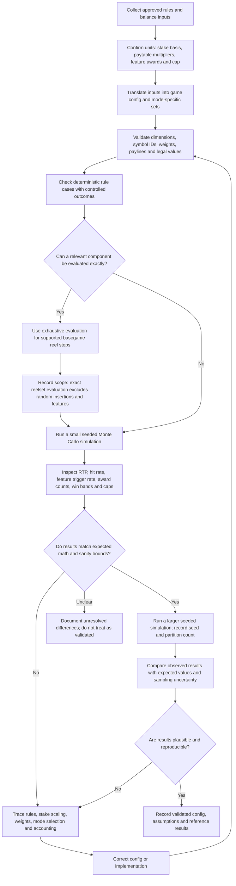

# Game math validation flow

Use this flow to validate game rules and configuration before treating a Monte Carlo result as a meaningful estimate. The simulator reports observed outcomes; a run by itself does not prove that the configured math matches the intended design.

## Checklist

- Confirm the paytable's unit (for example, multiple of total round stake) and that basegame and freegame use the intended stake basis.
- Check that weighted tables have valid nonnegative entries, positive total weight, and the intended relative probabilities.
- Verify reel and visible-grid dimensions, symbol mappings, feature eligibility, and mode-specific settings.
- Use deterministic tests for wins, losses, trigger thresholds, feature-spin counts, retriggers, caps, and boundary cases.
- For supported reel games, compare the basegame reel/paytable cycle using the full reelset tool. Its current evaluator intentionally skips randomized insertions, triggers, feature spins, and multipliers; interpret its result as a component check.
- Run a seeded Monte Carlo sample and inspect basegame, freegame, and total-game results separately. Check trigger frequency, award categories, hit frequency, distributions, and win-cap counts alongside RTP.
- Record the effective seed, logical partition count, configuration revision, run size, and known approximations so another run can be compared fairly.
- Treat sampling variation separately from rule mismatches. Increase run size when the estimate is noisy; investigate systematic differences in config, stake scaling, feature accounting, or random selection.

The workflow describes a review process, not an automated certification feature. Exact full-game analysis is not currently provided for games with random feature mechanics.
