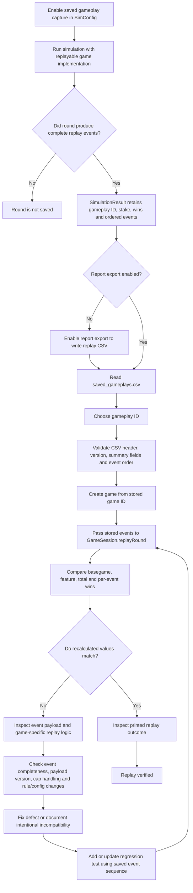

# Replay and debugging flow

Use replay to reconstruct a saved round from its game-specific decisions and compare the recalculated outcome with the stored summary.



## Current replay contract

- The report writes one CSV row per ordered replay event, with shared gameplay summary fields repeated on each row. Event payloads are game-owned opaque strings; the CSV format currently declares version `1`.
- Replay starts with a `basegame` event. Subsequent events represent that game's feature spins. The game implementation owns decoding and recalculating these events through `GameSession.replayRound`.
- `ReplayerMain` selects the game from the saved game ID, invokes replay with the recorded stake and game win cap, and compares basegame, feature, total, event count, event types, and event wins.
- A win mismatch is reported as replay failure. Investigate whether the payload captured every random choice needed for recalculation, whether event order is intact, and whether changed game rules intentionally affect old replay data.
- Replay support is optional in `GameSession`. A game without replay support cannot be reconstructed by the current replayer, and rounds without complete events are not included in the saved gameplay list.

Run a replay from the repository root with:

```sh
java toolkit.replay.ReplayerMain <saved-gameplays.csv> <gameplay-id>
```
