# Simulation and reporting flow

This diagram follows a run from either launcher through Monte Carlo execution and reporting. Game-specific round logic lives behind `GameSession`; the runner handles generic accounting and aggregation.

```mermaid
flowchart TD
    subgraph Entry[Run entry points]
        CLI[Main.java]
        GUI[ToolkitGUI simulation action]
    end

    subgraph Setup[Run setup]
        Config[SimConfig: game, rounds, stake, seed, partitions, output options]
        Factory[GameFactory.create gameId]
        Game[Selected Game implementation]
    end

    subgraph Simulation[SimulationRunner]
        Validate[Validate config and resolve effective seed]
        Stats[Create total, basegame, freegame and per-set statistics]
        Split[Split rounds into logical partitions]
        Worker[Worker creates seeded Random and GameSession]
        Play[Play one basegame round]
        Base[Accumulate basegame and basegame-set results]
        Trigger{Free spins triggered?}
        Free[Play freegame spins; accumulate freegame and set results]
        Total[Record total-round win distribution]
        Replay{Capture complete replay for this round?}
        Save[Keep replay events for CSV export]
        Again{More rounds in partition?}
        Merge[Merge partition statistics in partition order]
        Result[Build SimulationResult with stats, replays and elapsed time]
    end

    subgraph Reporting[Print reporting]
        Print[Print.printToConsole]
        Summary[Print total, basegame, freegame and per-set summaries]
        Export{exportReport enabled?}
        Folder[Create reports/simulation-timestamp folder]
        Files[Write simulation_stats.txt and win-distribution CSVs]
        HasReplay{Saved gameplays available?}
        ReplayCsv[Write saved_gameplays.csv]
        Settings[Print game, partitions, seed and elapsed time]
        End[Run complete]
    end

    CLI --> Config
    GUI --> Config
    Config --> Factory --> Game
    Config --> Validate
    Game --> Validate --> Stats --> Split --> Worker --> Play --> Base --> Trigger
    Trigger -->|Yes| Free --> Total
    Trigger -->|No| Total
    Total --> Replay
    Replay -->|Yes| Save --> Again
    Replay -->|No| Again
    Again -->|Yes| Play
    Again -->|No| Merge
    Merge --> Result --> Print --> Summary --> Export
    Export -->|No| Settings
    Export -->|Yes| Folder --> Files --> HasReplay
    HasReplay -->|Yes| ReplayCsv --> Settings
    HasReplay -->|No| Settings
    Settings --> End
```

The detailed report contains `simulation_stats.txt`, `win_distributions.csv`, and `win_distribution_aggregated.csv`. Replayable gameplay is written to `saved_gameplays.csv` only when the run captured complete replay events.
